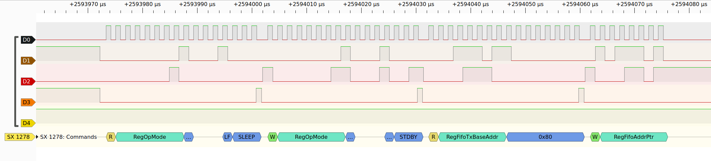

# Sigrok decoder for LoRa

Works with SX1278 but may also support other SX127x chips as well. Work is in progress.

## Installation

1. Clone the repo in a `$directory`
2. Run PulseView with
   ```sh
   $ SIGROKDECODE_DIR="$directory" pulseview
   ```
3. Stack the decoder on top of configured SPI decoder


